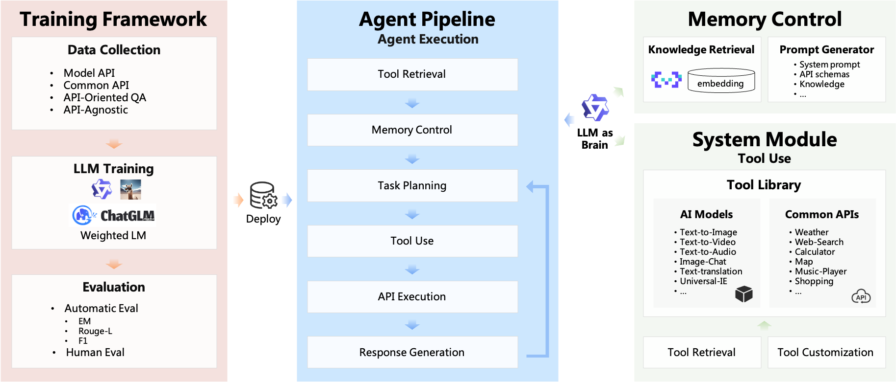

<h1> ModelScope-Agent: 基于开源大语言模型的可定制Agent系统</h1>
<p align="center">
    <br>
    
    <br>
<p>

<p align="center">
<a href="https://modelscope.cn/home">魔搭社区</a>
<br>
        中文&nbsp ｜ &nbsp<a href="README.md">English</a>
</p>

## 简介

**ModelScope-Agent**是一个通用的、可定制的Agent框架，用于实际应用程序，其基于开源的大语言模型 (LLMs) 作为核心。它提供了一个用户友好的系统库，
具有以下特点：
- **可定制且功能全面的框架**：提供可定制的引擎设计，涵盖了数据收集、工具检索、工具注册、存储管理、定制模型训练和实际应用等功能，可用于快速实现实际场景中的应用。
- **开源LLMs作为核心组件**：支持在 ModelScope 社区的多个开源LLMs上进行模型训练。
- **多样化且全面的API**：以统一的方式实现与模型API和常见的功能API的无缝集成。



为了赋予LLMs工具使用能力，提出了一个全面的框架，涵盖了数据收集、工具检索、工具注册、存储管理、定制模型训练和实际应用的方方面面。

## 安装

克隆repo并安装依赖：
```shell
git clone https://github.com/modelscope/modelscope-agent.git
cd modelscope-agent && pip install -r requirements.txt
```


## 快速入门

使用 ModelScope-Agent，您只需要实例化一个 `AgentExecutor` 对象，并使用 `run()` 来执行您的任务即可。

如下简单示例，更多细节可参考[demo_agent](demo/demo_qwen_agent.ipynb)。

```Python
import os
from modelscope.utils.config import Config
from modelscope_agent.llm import LLMFactory
from modelscope_agent.agent import AgentExecutor
from modelscope_agent.prompt import MSPromptGenerator

# get cfg from file, refer the example in config folder
model_cfg_file = os.getenv('MODEL_CONFIG_FILE', 'config/cfg_model_template.json')
model_cfg = Config.from_file(model_cfg_file)
tool_cfg_file = os.getenv('TOOL_CONFIG_FILE', 'config/cfg_tool_template.json')
tool_cfg = Config.from_file(tool_cfg_file)

# instantiation LLM
model_name = 'modelscope-agent-qwen-7b'
llm = LLMFactory.build_llm(model_name, model_cfg)

# prompt generator
prompt_generator = MSPromptGenerator()

# instantiation agent
agent = AgentExecutor(llm, tool_cfg, prompt_generator=prompt_generator)
```

- 单步 & 多步工具使用

```Python
# Single-step tool-use
agent.run('使用地址识别模型，从下面的地址中找到省市区等元素，地址：浙江杭州市江干区九堡镇三村村一区', remote=True)

# Multi-step tool-use
agent.reset()
agent.run('写一篇关于Vision Pro VR眼镜的20字宣传文案，并用女声读出来，同时生成个视频看看', remote=True)
```

<div style="display: flex;">
  
  
</div>

- 多轮工具使用和知识问答

```Python
# Multi-turn tool-use
agent.reset()
agent.run('写一个20字左右简短的小故事', remote=True)
agent.run('用女声念出来', remote=True)
agent.run('给这个故事配一张图', remote=True)
```

<div style="display: flex;">
  
  
</div>

### 主要组件

`AgentExecutor`对象包括以下组件：

- `LLM`：负责处理用户输入并决策调用合适工具。
- `tool_list`：包含代理可用工具的列表。
- `PromptGenerator`：提示词管理组件，将 `prompt_template`、`user_input`、`history`、`tool_list` 等整合到高效的提示词中。
- `OutputParser`：输出模块，将LLM响应解析为要调用的工具和相应的参数。

我们为用户提供了这些组件的默认实现，但用户也可以根据自己的需求自定义组件。


### 配置

对于用户隐私相关的配置，如 `user_token` 等不应该公开，因此我们建议您使用 `dotenv` 包和 `.env` 文件来设置这些配置。

具体来说，我们提供了一个模版文件 `.env.template` ，用户可以复制并更改文件名为`.env` 来进行个人配置管理，

并通过 `load_dotenv(find_dotenv())` 来加载这些配置。 另外，用户也可以直接通过设置环境变量的方式来进行token的配置。

除此之外，我们还提供了一个模型配置文件模版 `cfg_model_template.json` ，和一个工具类配置文件模版 `cfg_tool_template.json`.

我们已经将默认的配置填入，用户可以直接使用，也可以复制并更改文件名，进行深度定制。

### LLM

我们提供了开箱即用的LLM方便用户使用，具体模型如下：
* modelscope-agent-qwen-7b: [modelscope-agent-qwen-7b](https://modelscope.cn/models/damo/MSAgent-Qwen-7B/summary)是基于Qwen-7B基础上微调训练后的，驱动ModelScope-Agent框架的核心开源模型，可以直接下载到本地使用。
* ms_gpt: 部署在[DashScope](http://dashscope.aliyun.com)上的ModelScope-Agent服务，不需要本地GPU资源，在DashScope平台
    1. 申请开通DashScope服务，进入`模型广场`-> `通义千问开源系列` -> 申请试用`通义千问7B`， 免费额度为10万token
    2. `API-kEY管理`中创建API-KEY，在`config/.env`文件中配置


如果用户想使用其他LLM，也可以继承基类并专门实现 `generate()` 或 `stream_generate()`。

- `generate()`: 直接返回最终结果
- `stream_generate()`: 返回一个生成器用于结果的串行生成，在部署应用程序到 Gradio 时可以使用。

用户还可以使用 ModelScope 或 Huggingface 的开源LLM，并通过 `LLMFactory` 类在本地进行推断。此外，也可以使用用户的数据集对这些模型进行微调或加载您的自定义权重。

```Python
# 本地LLM配置
import os
from modelscope.utils.config import Config
from modelscope_agent.llm import LLMFactory
from modelscope_agent.agent import AgentExecutor

model_name = 'modelscope-agent-qwen-7b'
model_cfg = {
    'modelscope-agent-qwen-7b':{
        'model_id': 'damo/MSAgent-Qwen-7B',
        'model_revision': 'v1.0.2',
        'use_raw_generation_config': True,
        'custom_chat': True
    }
}

tool_cfg_file = os.getenv('TOOL_CONFIG_FILE', 'config/cfg_tool_template.json')
tool_cfg = Config.from_file(tool_cfg_file)

llm = LLMFactory.build_llm(model_name, model_cfg)
agent = AgentExecutor(llm, tool_cfg)
```


### 自定义工具

为了能支持各类任务应用，我们提供了多个默认的pipeline作为工具以便大模型调用，这些pipeline来自于modelscope，涵盖了多个领域。

此外，用户可以通过继承基础的工具类，并根据定义名称、描述和参数(`names, descriptions, and parameters`)来自定义自己的工具。

同时还可以根据需要实现 `_local_call()` 或 `_remote_call()`。 更多工具类的注册细节可参考[tool](docs/modules/tool.md)和[too_demo](demo/demo_register_new_tool.ipynb)。

以下是支持的工具示例：

- 文本转语音工具

```python
from modelscope_agent.tools import ModelscopePipelineTool
from modelscope.utils.constant import Tasks
from modelscope_agent.output_wrapper import AudioWrapper

class TexttoSpeechTool(ModelscopePipelineTool):
    default_model = 'damo/speech_sambert-hifigan_tts_zh-cn_16k'
    description = '文本转语音服务，将文字转换为自然而逼真的语音，可配置男声/女声'
    name = 'modelscope_speech-generation'
    parameters: list = [{
        'name': 'input',
        'description': '要转成语音的文本',
        'required': True
    }, {
        'name': 'gender',
        'description': '用户身份',
        'required': True
    }]
    task = Tasks.text_to_speech

    def _remote_parse_input(self, *args, **kwargs):
        if 'gender' not in kwargs:
            kwargs['gender'] = 'man'
        voice = 'zhibei_emo' if kwargs['gender'] == 'man' else 'zhiyan_emo'
        kwargs['parameters'] = voice
        kwargs.pop('gender')
        return kwargs

    def _parse_output(self, origin_result, remote=True):

        audio = origin_result['output_wav']
        return {'result': AudioWrapper(audio)}
```

- 文本地址工具

```python
from modelscope_agent.tools import ModelscopePipelineTool
from modelscope.utils.constant import Tasks

class TextAddressTool(ModelscopePipelineTool):
    default_model = 'damo/mgeo_geographic_elements_tagging_chinese_base'
    description = '地址解析服务，针对中文地址信息，识别出里面的元素，包括省、市、区、镇、社区、道路、路号、POI、楼栋号、户室号等'
    name = 'modelscope_text-address'
    parameters: list = [{
        'name': 'input',
        'description': '用户输入的地址信息',
        'required': True
    }]
    task = Tasks.token_classification

    def _parse_output(self, origin_result, *args, **kwargs):
        final_result = {}
        for e in origin_result['output']:
            final_result[e['type']] = e['span']
        return final_result
```

此外，如果用户希望使用来自`langchain`的工具，我们也为用户提供了便捷接口。用户可以直接使用 `LangchainTool` 来进行调用。 具体如下：

```Python

from modelscope_agent.tools import LangchainTool
from langchain.tools import ShellTool

# 包装 langchain 工具
shell_tool = LangchainTool(ShellTool())

print(shell_tool(commands=["echo 'Hello World!'", "ls"]))

```

## 引用
如果您觉得这个工作很有用，请考虑给这个项目加星，并引用我们的论文，感谢：
```
@misc{modelscope-agent,
      title={ModelScope-Agent: Building Your Customizable Agent System with Open-source Large Language Models},
      howpublished = {\url{https://github.com/ModelScope/modelscope-agent}},
      year={2023}
}
```
